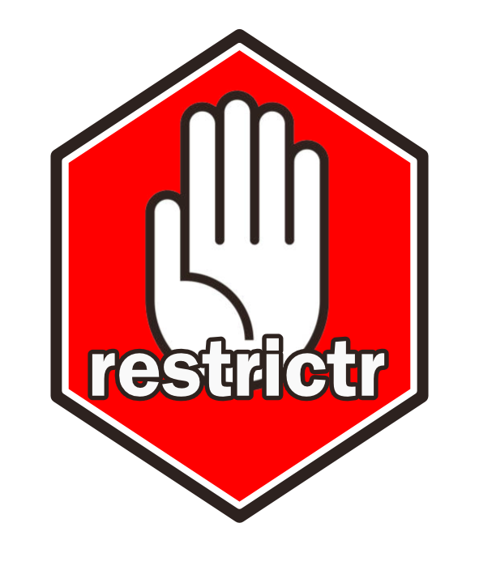

<!-- README.md is generated from README.Rmd. Please edit that file -->

# restrictr 

<!-- badges: start -->

[](https://github.com/LJ-Jenkins/restrictr/actions/workflows/R-CMD-check.yaml)
<!-- badges: end -->

restrictr provides tools for the validation and safe type
coercion/recycling of function arguments. Note: This package is still in
the development stage and is subject to change.

## Overview

- `abort_if_not()` for general validation.
- `cast_if_not()` and `recycle_if_not()` for safe type casting and
  recycling of variables.
- `schema()` for the validation of named elements of data.frames/lists.
- `schema_cast()` and `schema_recycle()` for the safe type casting and
  recycling of named elements of data.frames/lists.
- `restrict()` for validation, safe type casting and safe recycling of
  both variables and named elements of data.frames/lists.

## Installation

You can install the development version of restrictr from
[GitHub](https://github.com/) with:

``` r
# install.packages("pak")
pak::pak("LJ-Jenkins/restrictr")
```

## Examples

`abort_if_not` can be used for all validations:

``` r
library(restrictr)

f <- \(x, y) {
  abort_if_not(
    is.character(x),
    "`{x}` is too short!" = nchar(x) > 5,
    y$x == 1
  )
}

# f(1L, list(x = 1))
# Error in `f()`:
# Caused by error in `abort_if_not()`:
# ℹ In argument: `is.character(x)`.
# ! Returned `FALSE`.

# f("hi", list(x = 1))
# Error in `f()`:
# Caused by error in `abort_if_not()`:
# ℹ In argument: `nchar(x) > 5`.
# ! `hi` is too short!
```

`cast_if_not` and `recycle_if_not` provide safe casting and recycling
from [vctrs](https://vctrs.r-lib.org/). Variables are provided on the
left hand side and the expected type/size is provided on the right.
Assignment is automatically done back into the environment specified
(default is the
[caller_env()](https://rlang.r-lib.org/reference/stack.html)):

``` r
f <- \(x, y) {
  cast_if_not(x = double())
  recycle_if_not(y = x)

  print(class(x))
  print(length(y))
}

# f(5L, 1)
# [1] "numeric"
# [1] 5

f <- \(x) {
  cast_if_not(x = integer(), .lossy = TRUE)

  print(x)
}

# f(1.5)
# [1] 1

# f("hi")
# Error in `f()`:
# Caused by error in `cast_if_not()`:
# ℹ In argument: `x = integer()`.
# ! Can't convert `x` <character> to <integer>.
```

`schema`, `schema_cast` and `schema_recycle` provide the same
functionality for data-masked arguments from data.frames/lists. The size
of the data.frame/list and whether certain names are present can also be
checked using the `.names` and `.size` arguments. The altered data-mask
object is returned for `schema_cast` and `schema_recycle` (nothing is
returned for `schema`):

``` r
f <- \(df) {
  df |>
    schema(x == 1)
}

# f(data.frame(x = 2))
# Error in `f()`:
# Caused by error in `schema()`:
# ℹ In argument: `x == 1` for data mask `df`.
# ! Returned `FALSE`.

f <- \(df) {
  df <- df |>
    schema_cast(x = double())

  print(class(df$x))
}

# f(data.frame(x = 1L))
# [1] "numeric"

# schema_recycle is only implemented for lists.
f <- \(li) {
  li <- li |>
    schema_recycle(x = 3, y = 5, z = vctrs::vec_size(x))

  print(lengths(li))
}

# f(list(x = 1, y = 1, z = 1))
# x y z
# 3 5 3
```

`restrict` combines all functionality into a multi-purpose tool. Both
variables and named elements within data.frames/lists can be validated
and casted/recycled. They keyword functions of `validate`, `cast`,
`lossy_cast`, `recycle` and `coerce` determines whether any type casting
and/or recycling occurs. Validation functions can then be given, either
in the form of functions or lambdas. Assignment occurs back into the
environment specified (default is the
[caller_env()](https://rlang.r-lib.org/reference/stack.html)). A
contradictory example just to show features:

``` r
f <- \(df, x) {
  restrict(
    df = validate(
      type = data.frame(x = integer()),
      size = 1,
      ~ ncol(.x) == 1,
      \(.x) colnames(.x) == "x"
    ),
    x = cast(type = .env$x, mask = df),
    x = coerce(type = integer(), size = df$x, lossy = TRUE)
  )

  cat("`df$x` casted to", class(df$x), "from the initial `x` class \n")
  cat("`x` lossily casted to", class(x), "and recycled using value of `df$x` to length", length(x))
}

# f(data.frame(x = 3L), 1.5)
# `df$x` casted to numeric from the initial `x` class
# `x` lossily casted to integer and recycled using value of `df$x` to 3

#-- vctrs type/size rules are for all `cast`, `recycle` and `coerce` calls within restrictr functions
f <- \(df) {
  restrict(df = validate(type = data.frame(x = integer(), y = double())))
}

# f(data.frame(x = 1L, y = "hi"))
# Error in `f()`:
# Caused by error in `restrict()`:
# ℹ In argument: `df`.
# ! Returned <data.frame</ x: integer/ y: character/>>, not <data.frame</ x: integer/ y: double/>>.

f <- \(x) {
  restrict(x = recycle(size = 10))
}

# f(1:5)
# Error in `f()`:
# Caused by error in `restrict()`:
# ℹ In argument: `x`.
# ! Can't recycle `x` (size 5) to size 10.
```

### Notes

restrictr and `restrict` were inspired by MATLAB’s [arguments
block](https://uk.mathworks.com/help/matlab/ref/arguments.html).

restrictr functions do not do any clean-up in the case of errors. As
typical usage should be within functions, this should have little
impact. However, if you intend to continue using the variables in the
associated environments, care should be taken. See the following
example:

``` r
local({
  x <- 1L
  y <- 1L
  cast_if_not(x = double(), y = character()) |> try()
  cat(
    "Code has errored but `x` has still been casted to:",
    class(x), "\n",
    "in the environment specified for the `cast_if_not` call."
  )
})
#> Error in eval(quote({ : Caused by error in `cast_if_not()`:
#> ℹ In argument: `y = character()`.
#> ! Can't convert `y` <integer> to <character>.
#> Code has errored but `x` has still been casted to: numeric 
#>  in the environment specified for the `cast_if_not` call.
```
